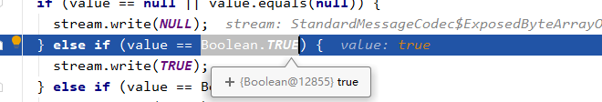

# 关于使用 methodChannel 传值问题

尽量不要使用布尔类型的值，因为 methodChannel 使用 boolean 类型，使用了基本类型的常量对象来比较，从而不能支持包装类型的Boolean对象实例了（因为和常量对象不是同一个实例，所以判断为不相等），代码如下：

```java
//StandardMessageCodec
  protected void writeValue(ByteArrayOutputStream stream, Object value) {
    if (value == null || value.equals(null)) {
      stream.write(NULL);
    } else if (value == Boolean.TRUE) { 
      stream.write(TRUE);
    } else if (value == Boolean.FALSE) {
      stream.write(FALSE);
    }
  }
```

如下情况并不会相等




**补充说明：**其实上面的问题是因为在使用 flutter boost 的时候更加容易出现，因为使用 flutter boost 进行页面跳转的时候（即从一个 BoostFlutterActivity 跳转到另外一个 BoostFlutterActivity 时）传递的 map 参数需要经过序列化和反序列化，而boolean类型在反序列化时会通过 newInstance 来创建其实例，从而导致新实例对象不等于常量对象了，最终会导致 methodChannel 在 writeValue 时编码报错。

最新的 flutter 已经修复了此问题，可以看这个 [commit](https://github.com/flutter/engine/commit/13453596424988afa5eebafb5511b0bacbab19ae)