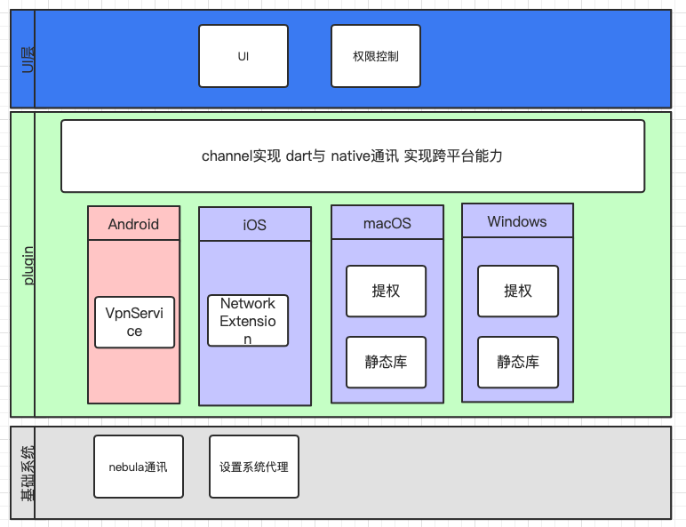

涉及平台：mac、windows、iOS、Android
涉及技术：网络、go、flutter、swift、C++、OC、java

# 目标

实现在公司外部访问公司内部服务器（即内网穿透功能）、任意客户端任意地点通过代理访问公司门户网站以达到控制访问ip的目的（代理功能）

# 实现思路

因为考虑到跨平台的问题，经过一段时间调研最终选定使用[nebula](https://github.com/slackhq/nebula)，小巧、简单同时也完美的支持跨平台。

通过nebula可以把不同网络之间的设备拉到一个相同的虚拟内网中，然后内网穿透功能就可以通过公司防火墙上的某个机器做转发实现，代理功能可以通过本地挂代理的方式让访问某些网站的时候代理到一个特定的代理机器做为访问公司门户网站的入口。同时 nebula 支持通过证书的形式来实现权限控制，以及对流量加密的功能。

然后上层实现不同用户的权限控制以及nebula证书下发的功能。

# 整体架构

上层使用 flutter 实现UI界面同时达到嵌入到当前项目以实现权限控制的目的。

底层使用go语言实现启动客户端与vpn节点通讯的能力。

中间使用flutter plugin 实现上层与底层库对应平台之间的通讯能力，同时实现在对应平台的一些特别化操作。

